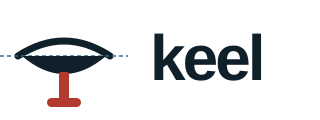

<p align="left">
  <picture>
    <source media="(prefers-color-scheme: dark)" srcset="assets/logo-dark.svg">
    
  </picture>
</p>

**A plan-driven operating layer for coding agents — any agent, any model.**

Site: [matrixfede.github.io/keel](https://matrixfede.github.io/keel/) · the same page, with the logo proposal and the diagrams, lives in [`docs/index.html`](docs/index.html).

[](https://github.com/matrixfede/keel/actions/workflows/ci.yml)
[](LICENSE)

A keel is the part of a boat you never see and cannot sail without: it keeps
the hull on course when the wind pushes sideways. `keel` does that for a coding
agent. It is a small set of markdown rules, templates and shell scripts you drop
into a repository so that Codex, Claude Code, Gemini CLI, Cursor, Copilot,
OpenCode, Aider or Pi work the same way on complex tasks: **plan first, get the
plan approved, verify before closing, keep an append-only record, and never let
the agent grade its own work.**

No framework, no server, no SDK. Markdown, bash (3.2 or newer — a stock Mac is
fine), python3 standard library, git.

```
AGENTS.md                      # the rules (gate, method, style) — agents.md standard, read natively by most agents
adapters/                      # bridge files for agents that do not read AGENTS.md (Claude Code, Gemini CLI, Aider) + compatibility matrix
docs/AGENT_SOP.md              # operating procedures SOP-0..SOP-10
PLAN.template.md               # the working memory (state)
PROGRESS.template.md           # the progress log (history, append-only)
prompts/                       # role prompts: research, data, code, arguer, checker (+ JSON schema)
scripts/verify.sh              # validation gate — VERIFY: PASS|FAIL (includes the plan graph)
scripts/plan_graph.py          # PLAN.md as a graph: cycles, groups, contracts, waves → GRAPH: OK|FAIL
scripts/checker.sh             # fresh-context checker for critical tasks → CHECKER: KEEP|DROP
scripts/premortem.sh           # plan pre-mortem before the go → PREMORTEM: DONE
scripts/fanout.sh              # parallel run of a [Pn] group + model-free reduction → FANOUT: PASS|FAIL
scripts/lib_agent.sh           # the only place an agent CLI is invoked: codex|claude|gemini|opencode|copilot|custom
scripts/hooks/claude_gate.sh   # (Claude Code only) the gate enforced at write time, not only at commit
scripts/health_report.sh       # state snapshot at session start
scripts/install_git_hook.sh    # pre-commit hook: 4 deterministic checks
scripts/snapshot_ui.mjs        # frontend: screenshots + console errors
scripts/agent_logging.py       # structured logging readable by an agent
tests/run_tests.sh             # 61 end-to-end checks, no agent or network needed
```

## Install into a project

```bash
git clone https://github.com/matrixfede/keel.git /tmp/keel
cd /path/to/your/project
cp -r /tmp/keel/{AGENTS.md,docs,prompts,adapters,scripts,PLAN.template.md,PROGRESS.template.md} .
chmod +x scripts/*.sh scripts/hooks/*.sh adapters/*.sh
mkdir -p logs/agent && echo "logs/" >> .gitignore
bash scripts/install_git_hook.sh
bash adapters/install_adapter.sh claude    # only if you use Claude Code (also: gemini, aider, all)
git add AGENTS.md docs prompts adapters scripts PLAN.template.md PROGRESS.template.md .gitignore
git commit -m "chore: add keel"
```

If the project already has an `AGENTS.md`, do not overwrite it: append this
one to yours. Codex, Cursor, Copilot, OpenCode and Pi read `AGENTS.md` on
their own from the root — open the agent in the folder and the rules are
active. Claude Code, Gemini CLI and Aider need a bridge file;
`adapters/install_adapter.sh` creates it (details and the full matrix in
[`adapters/README.md`](adapters/README.md)).

An agent CLI is needed only by `checker.sh`, `premortem.sh` and `fanout.sh`,
to open fresh-context sessions automatically. `scripts/lib_agent.sh` picks the
first one available among codex, claude, gemini, opencode, copilot (or the one
in `AGENT_BACKEND`; `custom` for anything else). Without one, the same scripts
write the prompt to paste into a session you open by hand — with any agent,
even a web chat — and record the outcome with `--record` / `--reduce`. Flags
were verified against real CLI versions (codex 0.153, claude-code 2.1,
gemini-cli 0.58, opencode 1.18, copilot 1.0); if yours differs, there is one
file to fix.

## How a session goes

**You never have to ask for the plan.** The gate in `AGENTS.md` fires on its
own: the agent classifies every request and, if it is complex, produces the
plan and stops.

1. **Describe the problem, not the command.** Not "add multi-sample support",
   but: *"The VCFs come from TVC and the parser assumes single-sample; we need
   N samples without breaking the existing callers."*
2. **The agent produces the plan and waits.** It fills the table, applies the
   fake edge test, writes the output contracts, checks the graph
   (`plan_graph.py` → `GRAPH: OK`) and, if the plan has critical tasks or
   hard-to-undo actions, runs the fresh-context pre-mortem. It ends the turn
   with `Plan awaiting approval. Reply "go" to proceed...` and goes no
   further. In the plan you find the assumptions (`ASSUMED:`), the three most
   likely failure modes with their countermeasure (`PRE-MORTEM:`) and any
   alternative approaches it proposes.
3. **Read the table and the `PRE-MORTEM:` lines.** Look especially at the
   "Verification" column (a row without one will be closed by eye), the edges
   in "Depends on", and the countermeasures the agent chose.
4. **Reply "go"** to approve, or state your corrections. If you correct, the
   plan stays `DRAFT` and comes back to you.
5. **From there it works.** It creates `PROGRESS.md`, marks `🔄`, runs the
   verifications, marks `✅` only on a positive result, appends a log entry at
   every checkpoint, and explains every action in plain words: what it does,
   why, and what the effect will be.

To skip the gate in a specific case, say so explicitly: "skip the plan" or
"just do it". A brisk tone is not enough — it must be said.

## Communication style

Section 5 of `AGENTS.md` imposes plain, thorough language with a two-way rule:
common words lead the sentence, but the technical term the agent would have
used always appears in parentheses — "I save the changes into the project
history (commit)". You understand at once and learn the vocabulary along the
way; from the second use in the same session the term can stand alone. Every
action is explained in three parts — what, why, effect — plus a plain summary
at every task closure. With a guard against the opposite excess: 3-5 sentences
per action, not pages, and no repeating the plan. The agent answers in the
language you write in.

This style costs more tokens than a telegraphic one. It is a chosen trade —
understandability for verbosity — and on very long sessions you notice it. If
the style degrades after hours of work, a "re-read section 5" realigns the agent.

## Working method

Section 6 of `AGENTS.md` codifies three anti-drift principles (adapted from
Karpathy's observations on typical LLM failure modes): **assumptions always
explicit** (`ASSUMED:` prefix in the plan, where you approve or correct them),
**simplicity** (the minimum deliverable that meets the requirements — "might
be useful" additions become proposed tasks, not code), and **surgical changes**
(every diff line must trace back to the task; what the agent notices could be
fixed is flagged, never fixed on its own initiative). The fourth principle —
verifiable goals with a check per step — needs no adding: it is the plan
system itself.

## Agents, loops, graphs: what keel does at each level

Three ideas, one model. An **agent** gets the end state to reach instead of
the steps; a **loop** makes that work reliable by iterating against a check
that can fail; a **graph** runs agents and loops in parallel where the
dependencies allow it. keel uses them like this.

### Agent: memory in two files

`PLAN.md` is the **state** (where we are): objective, requirements, table,
contracts, decisions. `PROGRESS.md` is the **history** (how we got here): one
entry per checkpoint — plan approved, every `✅`, every `⛔`, end of session —
in the shape DID / DECIDED / BLOCKED / NEXT, under 100 words, **append-only**
(SOP-10). On resume the agent reads both and restarts from the last `NEXT`;
when it drifts, you scroll the log and see the exact entry where it went
sideways. To hand the work to a person, point them at `PROGRESS.md`. The hook
refuses commits that remove lines from the log.

### Agent: the arguer (plan pre-mortem)

Asking the agent "is the plan good?" yields a yes. `scripts/premortem.sh`
(SOP-9) flips the question: it opens a new session that sees only `PLAN.md`
and, with `prompts/arguer.md`, has it narrate how the plan failed 12 months
out — most likely first — aiming where the plan is weak by construction: the
`ASSUMED:` lines, the edges and `[P]` groups, the verifications that would pass
even with a wrong result. Mandatory with `critical` tasks or hard-to-undo
actions; the top three risks enter the plan as `PRE-MORTEM:` lines with the
chosen countermeasure, and you approve them with the table.

### Loop: a rubric that shows its work

For deliverables that `verify.sh` cannot judge (documents, reports, analyses)
the verification is `rubric` (SOP-7): 3-5 measurable criteria declared in the
plan and approved with it; the agent iterates with harsh self-scoring until
all reach 8, with a ceiling on passes. Every pass appends a row to
`logs/agent/rubric_task<n>.md` — weakest criterion, score, what changed, new
score — and the table is reported in chat, so you see the movement. If a score
drops, stop: the last change made it worse. If the same criterion is the
weakest for three rounds, the criterion is vague: it gets reworded, but through
the gate (plan back to `DRAFT`, rubric re-approved). Two stop conditions
always: success or ceiling — never one. And before declaring `rubric`, four
conditions: it will recur, it can judge itself, it closes without human input,
the finish line is a fact. If one is missing, the verification is "user
review" and the loop is not run.

### Graph: real dependencies, contracts, waves

The "Depends on" column holds only real dependencies, verified with the fake
edge test (SOP-8): an edge stays only if one task's output materially feeds
the other. Independent tasks get a `[P1]` label in Notes.
`python3 scripts/plan_graph.py` reads the table as a graph and fails on
cycles, non-existent dependencies, same-group tasks depending on each other,
tasks without verification or without a contract; it prints the execution
waves (wave 1 = everything that can start now) and the final outputs.
`verify.sh static`, `health_report.sh` and the hook run it. Every task in a
group declares a **contract** in the "Contracts" section of `PLAN.md` — `OUT`
(one file, never shared), `shape`, and a runnable `check` — because a node
with a declared output shape is readable by the next node with nobody in
between, and an output outside its shape is rejected, not adapted to.

### Graph: fan-out with a model-free reduction

By default groups still run sequentially: one coherent sequential agent wins in
most cases, and parallelism is paid in tokens and fragmented context. When you
ask for it or approve it in the plan, `scripts/fanout.sh P1` runs the
"diamond": one agent session per task, launched together, each with only its
task and its contract (the prompt opens with `FANOUT WORKER`, which in
`AGENTS.md` disables the gate and forbids touching `PLAN.md`/`PROGRESS.md`);
then a **model-free reduction** — zero tokens — checks that every `OUT` exists,
that the `check` passes, that every worker ended with `TASK n: DONE` and that
the plan files are intact. Only `FANOUT: PASS` authorizes convergence; the
main session updates the statuses. Ceiling: 4 tasks per group (`FANOUT_MAX`).

### Graph: the checker that cannot be bypassed

Whoever produces an output is not a good judge of that same output. For
`critical` tasks, `scripts/checker.sh <n> <artifact>` opens a new session in a
temporary folder holding **only a copy of the artifact** — no repo, no plan,
no conversation — and gives it `prompts/checker.md`: three independent checks
(accurate? current? do the references hold?), the "at least two out of three"
rule, an answer constrained to a JSON schema. The final verdict is computed by
the script: KEEP only if the model says KEEP **and** at least two checks pass.
The verdict goes to `logs/agent/checker_task<n>.txt` with the **SHA-256 hash
of the artifact**, and the hook recomputes it at commit: if the file changed
after the review, the KEEP expires. An earlier design looked for the word
`KEEP` in Notes — written by the same agent that did the work: a deterministic
check on a datum forgeable by the party being checked. Not anymore.

### Role prompts

`prompts/` holds research, data, code, arguer and checker, already in the
pack's style. The type of agent is the system prompt you give it: via API you
concatenate it with the rest (below); via a CLI you paste it as the first
message. `checker.md` and `arguer.md` are the "judge" part of the system and
are not touched mid-job.

### What was deliberately left out

A dollar ceiling between steps: the CLIs do not expose token counts uniformly
(Claude Code has `--max-budget-usd`, the others do not); the brakes are pass
ceilings (3 verification failures, 5 rubric rounds, 4 fan-out sessions). A YAML
workflow format: the table does the same job and the user can read it.
Trigger-driven autonomous execution: it is the opposite of the gate the pack is
built on. And the general rule stands: most jobs need neither a loop nor a
graph — use a loop when the work recurs and can grade itself, a graph when the
job is broad, the sources many and the answer needs verifying. Otherwise a
well-made sequential plan is enough.

## Agent compatibility

Nothing in keel depends on a model or an agent. Everything binding is in
formats every agent reads or runs: markdown (`AGENTS.md` in the agents.md
standard, `PLAN.md`, `PROGRESS.md`), standard python3 (`plan_graph.py`), git
(the pre-commit hook — identical for all, and the point that cannot be
bypassed). The things that vary from agent to agent are isolated in two places:
**how the agent reads `AGENTS.md`** (`adapters/`: native for Codex, Cursor,
Copilot, OpenCode, Pi; bridge file for Claude Code, Gemini CLI, Aider) and
**how a fresh-context session is opened** (`scripts/lib_agent.sh`: one backend
per CLI, plus `custom`). What an agent cannot provide — the OS sandbox on
parallel sessions (Codex only), schema-constrained output (Codex only), the
gate enforced at write time (Claude Code only, via hook) — is documented in
`adapters/README.md` rather than faked.

## Safety net

```bash
bash scripts/install_git_hook.sh
```

Installs a `pre-commit` with four deterministic checks: it refuses code
commits while `PLAN.md` is `DRAFT`; refuses commits where a `critical` task is
`✅` without the checker's verdict file with a still-valid artifact hash;
refuses commits with a broken plan graph (`GRAPH: FAIL`); refuses commits that
remove lines from `PROGRESS.md`. It is identical for every agent: the rules in
`AGENTS.md` remain instructions the model could in theory skip; the hook is
not. Only Claude Code additionally offers a hook at write time
(`adapters/install_adapter.sh claude`); for the others this is the one place
where the rules are enforced in a way that cannot be bypassed. It does not
intercept writes to disk, only commits — but that is where unapproved work
becomes permanent. Deliberate bypass: `git commit --no-verify`.

## Human review of the plan

Cadence: at the end of a session, and in any case before restarting after a
requirements change.

What to check: (a) do the `✅` tasks correspond to code that really works?
(b) do the "Active requirements" still reflect the real intent? (c) are there
"Decisions", `ASSUMED:` or `PRE-MORTEM:` countermeasures you no longer agree
with? (d) are the edges in "Depends on" real? (e) does the last `PROGRESS.md`
entry tell the same story as the table?

How to intervene: edit the markdown directly. To reopen a task, demote it to
`⬜` with the note `(reopened by user: <reason>)`. **The reason note is
essential**: without it, on resume the agent may read the change as file
corruption and "fix" it. In `PROGRESS.md` you do not correct: you add an entry
saying what you changed and why.

Serious misalignment (typical after 2-3 accumulated requirement changes): do not
patch line by line. Rewrite the "Objective" section and ask the agent to
regenerate the table from it, preserving the statuses of the tasks still valid.

## API use

The content of `AGENTS.md` goes into the system-instructions field; append
`docs/AGENT_SOP.md` too and, if you want a role, the prompt from `prompts/`.
It works with any provider: only the field name changes.

```python
from pathlib import Path
system = "\n\n".join(Path(p).read_text() for p in
                     ["AGENTS.md", "docs/AGENT_SOP.md", "prompts/data.md"])

# OpenAI (Responses API)
from openai import OpenAI
resp = OpenAI().responses.create(model="<model>", instructions=system,
                                 input="Task: <problem description>.")

# Anthropic (Messages API)
import anthropic
msg = anthropic.Anthropic().messages.create(model="<model>", max_tokens=8000, system=system,
                                            messages=[{"role": "user", "content": "Task: <problem description>."}])

# Google (Gemini)
from google import genai
r = genai.Client().models.generate_content(model="<model>", contents="Task: <problem description>.",
                                          config={"system_instruction": system})
```

For the checker via API, `prompts/checker.schema.json` is a JSON schema to pass
as the structured-response format (OpenAI `text.format`, Gemini
`response_schema`; with Anthropic put it in the prompt and use the tolerant
parser of `checker.sh`): the verdict arrives already parsable.

## Tests

```bash
bash tests/run_tests.sh
```

61 end-to-end checks with no agent CLI and no network: the backends are
replaced by fake binaries that record their argv, so what is tested is keel's
own logic — the graph validator, the four hook checks, the checker's parsing
and verdict rule on every backend, the pre-mortem, fan-out in all three modes,
the adapters, the Claude Code gate. CI runs the suite on Ubuntu and on macOS
(whose stock bash is 3.2), plus shellcheck.

## Background

keel grew out of a plan-driven pack for a single agent, then absorbed the
three "gears" described in Alex Figura's *Agents, Loops, Graphs: The Complete
How-To* (2026) — the progress log, the loop that shows its work, the arguer,
the fresh-context checker, output contracts, the fan-out diamond — and then
was made agent-agnostic. The changelog has the details.

## License

[MIT](LICENSE) — © 2026 Federico Gabrielli.
